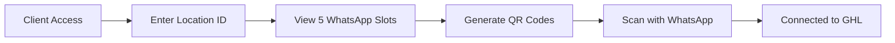

# 🚀 WhatsApp 100% - Multi-tenant Business Platform

**Connect multiple WhatsApp numbers to GoHighLevel CRM for automated marketing campaigns**

[](https://opensource.org/licenses/MIT)
[](https://nodejs.org/)
[](https://evolution-api.com/)
[](https://www.gohighlevel.com/)

## 📖 Overview

WhatsApp 100% is a powerful multi-tenant platform that allows businesses to connect up to 5 WhatsApp Business numbers per client to their GoHighLevel CRM. Built with Evolution API integration, it provides QR code generation, real-time synchronization, and automatic instance management.

### ✨ Key Features

- 🔥 **Multi-tenant Architecture** - Isolated environments per client
- 📱 **5 WhatsApp Instances** per client (expandable)
- 🔗 **Evolution API Integration** - Robust WhatsApp Business API
- ⚡ **Real-time QR Codes** - Instant connection setup
- 🎯 **GoHighLevel Ready** - Direct CRM integration
- 📊 **Simple Dashboard** - Clean, user-friendly interface
- 🚀 **Auto-deployment** - GitHub → Production ready

## 🎯 How It Works



1. **Client accesses dashboard** with their unique Location ID
2. **5 WhatsApp instances** are automatically created in Evolution API
3. **QR codes generate** in real-time for each slot
4. **Users scan QR codes** with their WhatsApp Business apps
5. **Numbers become available** in GoHighLevel for campaigns

## 🚀 Quick Start

### Prerequisites

- Node.js 16+
- Evolution API instance
- SQLite (included)

### Installation

```bash
# Clone the repository
git clone https://github.com/ramautos/whatsapp100-percent.git

# Navigate to project directory
cd whatsapp100-percent

# Install dependencies
npm install

# Configure environment variables
cp .env.example .env
# Edit .env with your credentials

# Start the application
npm start
```

### Environment Variables

```env
# Evolution API Configuration
EVOLUTION_API_URL=https://your-evolution-api.com
EVOLUTION_API_KEY=your-api-key

# Application Configuration
APP_URL=http://localhost:3000
NODE_ENV=development
PORT=3000
DATABASE_URL=sqlite:./database/platform.db
```

## 🎮 Usage

### For End Users

1. **Access your dashboard**: `https://your-domain.com/dashboard/YOUR_LOCATION_ID`
2. **View WhatsApp slots**: See 5 available WhatsApp connection slots
3. **Generate QR codes**: Click "Generate QR" for each slot you want to use
4. **Scan QR codes**: Use WhatsApp Business app to scan the QR codes
5. **Start using**: Connected numbers appear in your GoHighLevel account

### For Administrators

- **Health check**: `/health` - System status
- **API endpoints**: Full REST API for integration
- **Real-time monitoring**: WebSocket connections for live updates

## 🔧 API Endpoints

### Client Management

```http
POST /api/register
Content-Type: application/json

{
  "locationId": "CLIENT_12345",
  "companyName": "Company Name",
  "email": "contact@company.com"
}
```

### Instance Management

```http
# Get client instances
GET /api/instances/{locationId}

# Generate QR code
POST /api/instances/{locationId}/{number}/qr

# Health check
GET /health
```

## 🏗️ Architecture

### Tech Stack

- **Backend**: Node.js + Express.js
- **Database**: SQLite (production: PostgreSQL)
- **Real-time**: Socket.IO
- **WhatsApp API**: Evolution API
- **CRM Integration**: GoHighLevel

### Database Schema

```sql
-- Clients table
CREATE TABLE clients (
    id INTEGER PRIMARY KEY,
    location_id TEXT UNIQUE,
    company_name TEXT,
    email TEXT,
    created_at DATETIME DEFAULT CURRENT_TIMESTAMP
);

-- WhatsApp instances table
CREATE TABLE instances (
    id INTEGER PRIMARY KEY,
    client_id INTEGER,
    location_id TEXT,
    instance_name TEXT UNIQUE,
    instance_number INTEGER,
    status TEXT DEFAULT 'created',
    qr_code TEXT,
    phone_number TEXT,
    created_at DATETIME DEFAULT CURRENT_TIMESTAMP
);
```

## 🚀 Deployment

### Using Docker

```dockerfile
FROM node:16-alpine
WORKDIR /app
COPY package*.json ./
RUN npm ci --only=production
COPY . .
EXPOSE 3000
CMD ["npm", "start"]
```

### Using PM2

```bash
# Install PM2
npm install -g pm2

# Start application
pm2 start server.js --name "whatsapp100"

# Setup auto-restart
pm2 startup
pm2 save
```

## 🔒 Security

- Environment variables for sensitive data
- Input validation and sanitization
- Rate limiting on API endpoints
- Multi-tenant data isolation
- Secure webhook handling

## 🤝 Contributing

1. Fork the repository
2. Create your feature branch (`git checkout -b feature/AmazingFeature`)
3. Commit your changes (`git commit -m 'Add some AmazingFeature'`)
4. Push to the branch (`git push origin feature/AmazingFeature`)
5. Open a Pull Request

## 📄 License

This project is licensed under the MIT License - see the [LICENSE](LICENSE) file for details.

## 🆘 Support

- **Email**: ray@cloude.es
- **Documentation**: [GitHub Wiki](https://github.com/ramautos/whatsapp100-percent/wiki)
- **Issues**: [GitHub Issues](https://github.com/ramautos/whatsapp100-percent/issues)

## 🏆 Credits

Built with ❤️ by [Ray Alvarado](https://github.com/ramautos)

Powered by:
- [Evolution API](https://evolution-api.com/) - WhatsApp Business API
- [GoHighLevel](https://www.gohighlevel.com/) - CRM Platform
- [Node.js](https://nodejs.org/) - Runtime Environment

---

**⭐ Star this repo if you find it helpful!**

> 🚀 Ready to revolutionize your WhatsApp marketing? Get started now!